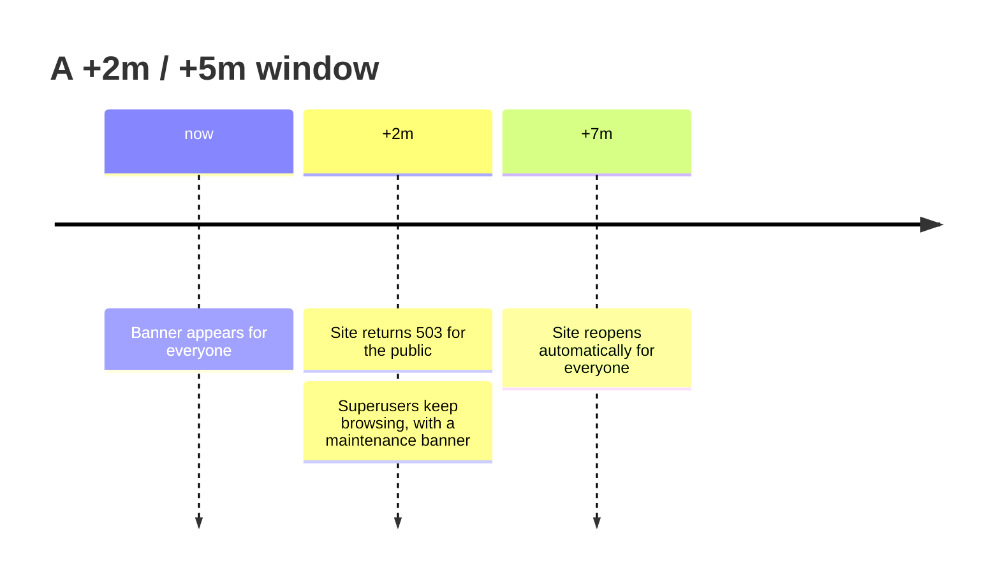

# Quickstart

Three minutes from a configured project to a site that announces, closes and
reopens itself. This page assumes you have finished
[Installation](installation.md).

## Schedule a window from the command line

```console
$ ./manage.py start_countdown \
      --banner +2m \
      --service +5m \
      --message "Database upgrade" \
      --noinput

About to create / replace countdown:
  Site:              example.com (id=1)
  Banner shows now → 2026-08-05 10:02:00 CEST
  Service mode ends: 2026-08-05 10:07:00 CEST
  Message:           Database upgrade

✓ Created countdown for example.com.
```

Read the two durations like this:

- `--banner +2m` — the banner is visible **from now**, and the site closes in
  two minutes.
- `--service +5m` — service mode lasts five minutes **counted from the moment
  the site closes**, not from now. The site reopens at `+7m`.

!!! tip "Reload the page"

    The banner appears on the *next* request. Nothing is pushed to open
    browser tabs — refresh to see it.

Run the command with no arguments for an interactive version that prompts for
each value with sensible defaults.

## Or create it in the admin

Django admin → **Site shutdown countdowns** → **Add**:

| Field | Meaning |
|---|---|
| Site | Which domain this countdown closes |
| Countdown time | When the site starts returning 503 |
| Maintenance end | When it reopens — leave empty for indefinite |
| Short message | Banner headline, max 200 characters |
| Long description | Optional paragraph shown on the maintenance page |

See [Django admin](../guide/admin.md) for the gotchas around editing a
countdown that has already expired.

## What you will see



Concretely:

1. **Before the cutoff** — every visitor sees the countdown banner with a live
   timer and the estimated duration of the upcoming maintenance.
2. **During the window** — anonymous and non-superuser visitors get the
   maintenance page with `HTTP 503`; the page shows its own timer counting
   down to reopening and reloads itself when it hits zero. Superusers browse
   normally and see a subdued "system under maintenance" banner instead.
3. **After `maintenance_until`** — the middleware stops blocking, and the
   banner disappears for everyone. The database row stays behind until you
   delete it.

For the full state table, see [How it works](../guide/how-it-works.md).

## Close the site indefinitely

Leave the end open when you cannot predict how long the work will take:

```console
$ ./manage.py start_countdown --banner +1m --service indefinite --noinput
✓ Created countdown for example.com.
  ⚠  Indefinite mode — the site will not reopen on its own. Run `manage.py stop_countdown` to unblock it.
```

Nothing reopens the site on its own in this mode. The maintenance page tells
visitors there is no scheduled end and reloads every 30 seconds, so the site
comes back for them as soon as you unblock it.

## Reopen the site

Deleting the countdown row is the universal "unblock now" action, whatever
state the window is in:

=== "Command"

    ```console
    $ ./manage.py stop_countdown --noinput
    ✓ Removed 1 countdown(s).
      example.com — unblocked
    ```

    Add `--site-id N` on a multi-tenant install; without it every site's
    countdown goes.

=== "Admin"

    **Site shutdown countdowns** → select the row → **Delete selected**.

    The admin stays reachable while the site is blocked, so this works even
    when you cannot get a shell.

!!! warning "Editing an expired countdown fails validation"

    `SiteCountdown.clean()` rejects any `countdown_time` in the past, so
    once a window has opened you cannot save the form again from the admin —
    even to push the end time out. Delete the row and create a new one.

## Try it without touching your project

The repository ships a runnable demo project:

```console
$ git clone https://github.com/iplweb/django-countdown.git
$ cd django-countdown
$ uv sync --all-extras
$ cd example
$ uv run python manage.py migrate
$ uv run python manage.py createsuperuser
$ uv run python manage.py runserver
```

- <http://127.0.0.1:8000/> — discovery page linking every blocked-page variant
- <http://127.0.0.1:8000/admin/> — never blocked, so you can always get back in
- <http://127.0.0.1:8000/healthz/> — plain endpoint that starts returning 503
