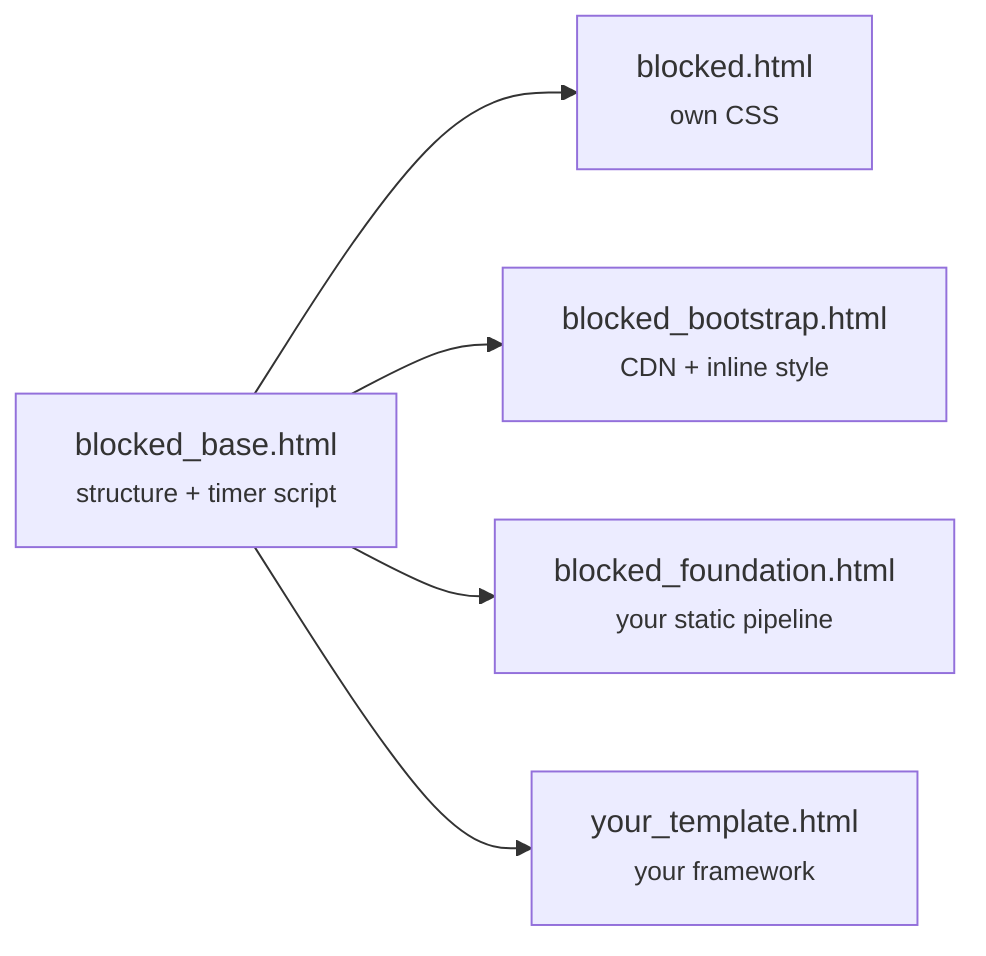

# Blocked page

The page the public gets while the window is open. It is rendered by the
middleware with `status=503` and a two-key context — `countdown` and `site` —
so it never touches your views, URLs or base template.

## Choosing a variant

Three ready-made variants ship with the package. Pick one with a single
setting:

```python title="settings.py"
DJANGO_COUNTDOWN_BLOCKED_TEMPLATE = "django_countdown/blocked_bootstrap.html"
```

| Template | Needs | Notes |
|---|---|---|
| `django_countdown/blocked.html` **(default)** | Nothing | Ships its own stylesheet via `` |
| `django_countdown/blocked_bootstrap.html` | Internet access from the visitor | Pulls Bootstrap 5.3 + Bootstrap Icons from jsDelivr, plus an inline `<style>` block |
| `django_countdown/blocked_foundation.html` | Foundation Sites in your own static pipeline | Expects `foundation-sites/dist/css/foundation.min.css` and `foundation-datepicker/foundation/fonts/foundation-icons.css` |

!!! warning "The Foundation variant assumes your asset paths"

    It references two specific `` paths. If your project does not
    serve Foundation at exactly those paths, the page renders unstyled. Either
    match the paths or override `blocked_stylesheets` — see below.

All three are thin subclasses of `django_countdown/blocked_base.html`, which
holds the entire structure and the countdown script. The variants differ only
in which stylesheets they load and which icon markup they emit.



## What the page shows

| Element | Source |
|---|---|
| Document title | "System under maintenance – {{ site.name }}" |
| Headline | Fixed, translated string |
| Message | `countdown.message` |
| Description | `countdown.long_description`, run through `linebreaks`, omitted when empty |
| Timer | Counts down to `countdown.maintenance_until` |
| Footer | Apology paragraph plus `site.name` |

With no `maintenance_until`, the timer block is replaced by "Maintenance has
no scheduled end. The site will become available once an administrator
unblocks it."

The page also reloads itself — after three seconds once the timer expires,
or every 30 seconds in indefinite mode — so visitors get back in without
having to keep hitting refresh.

## Writing your own variant

Subclass the base and override only what you need. This is the intended
extension point and keeps you on the shared structure and script:

```django title="templates/django_countdown/blocked_tailwind.html"



  <link rel="stylesheet" href="">


mx-auto max-w-xl p-8 text-center
text-2xl font-bold
<span class="text-3xl">🔧</span>

```

```python title="settings.py"
DJANGO_COUNTDOWN_BLOCKED_TEMPLATE = "django_countdown/blocked_tailwind.html"
```

!!! note "`` if you use ``"

    The base template loads `i18n` and `static` for its own use, but template
    tag libraries are not inherited by child templates. Add
    `` to yours.

Every available block, with its default value, is listed in
[Template blocks](../reference/template-blocks.md). The two broad strategies:

- **Class blocks** (`blocked_container_class`, `blocked_title_class`, …)
  replace the CSS classes on existing elements. Best when your framework
  needs different utility classes on the same structure.
- **`blocked_body`** replaces the whole page body. Use it when the structure
  itself is wrong for you — but note the countdown script lives *outside*
  that block and keeps running, so keep the element IDs it expects
  (`countdown-display`, `countdown-value`) if you want the timer to work.

## Replacing the shipped templates wholesale

To restyle without introducing a new name, put a file at the same path in
your own `DIRS` templates directory:

```
your_project/
└── templates/
    └── django_countdown/
        └── blocked.html      # shadows the packaged default
```

This is the right move when the packaged Bootstrap or Foundation variant is
*almost* right — copy it, adjust, and keep the setting pointing at the
original name.

## Testing it without waiting

The example project exposes preview URLs that render each variant against a
fabricated countdown, so you can iterate on styling without scheduling real
downtime:

```
/preview/plain/            /preview/plain/indefinite/
/preview/bootstrap/        /preview/bootstrap/indefinite/
/preview/foundation/       /preview/foundation/indefinite/
```

The same trick works in your own project — the templates only need
`countdown` and `site` in the context:

```python title="yourapp/views.py"
from datetime import timedelta

from django.contrib.sites.shortcuts import get_current_site
from django.shortcuts import render
from django.utils import timezone

from django_countdown.models import SiteCountdown


def preview_blocked(request):
    fake = SiteCountdown(
        site=get_current_site(request),
        countdown_time=timezone.now() - timedelta(minutes=5),
        maintenance_until=timezone.now() + timedelta(minutes=20),
        message="Preview: planned downtime",
        long_description="Rendered without touching the database.",
    )
    return render(
        request,
        "django_countdown/blocked.html",
        {"countdown": fake, "site": get_current_site(request)},
    )
```

The instance is never saved, so no countdown is created and nothing gets
blocked.

!!! danger "Do not leave a preview view public"

    It renders a convincing "we are down" page on demand. Gate it behind
    `@staff_member_required`, or register it only when `DEBUG` is on.

## Status code and caching

The response carries `HTTP 503 Service Unavailable`, which is the honest
status: temporary, do not deindex. The package does not set a `Retry-After`
header. If a CDN or reverse proxy sits in front of your site, check that it
does not cache 503 responses — otherwise the maintenance page can outlive the
window it was announcing.
