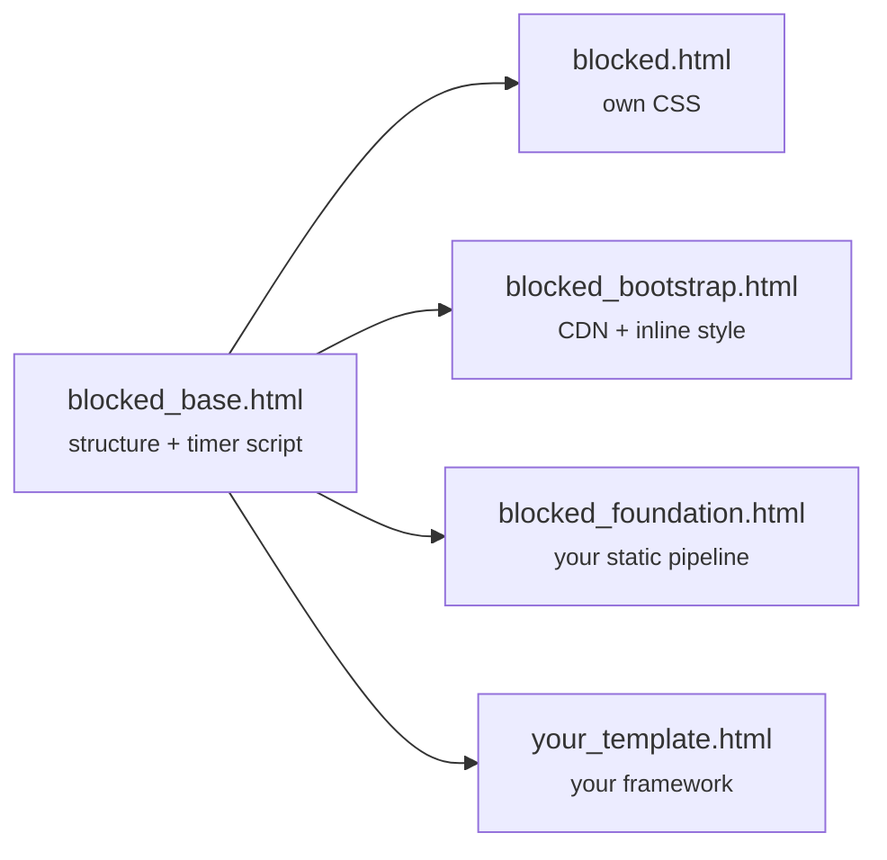

# Blocked page

The page the public gets while the window is open. It is rendered by the
middleware with `status=503` and a two-key context — `countdown` and `site` —
so it never touches your views, URLs or base template.

## Choosing a variant

Three ready-made variants ship with the package. Pick one with a single
setting:

```python title="settings.py"
DJANGO_COUNTDOWN_BLOCKED_TEMPLATE = "django_countdown/blocked_bootstrap.html"
```

| Template | Needs | Notes |
|---|---|---|
| `django_countdown/blocked.html` **(default)** | Nothing | Ships its own stylesheet via `` |
| `django_countdown/blocked_bootstrap.html` | Internet access from the visitor | Pulls Bootstrap 5.3 + Bootstrap Icons from jsDelivr, plus an inline `<style>` block |
| `django_countdown/blocked_foundation.html` | Foundation Sites in your own static pipeline | Expects `foundation-sites/dist/css/foundation.min.css` and `foundation-datepicker/foundation/fonts/foundation-icons.css` |

!!! warning "The Foundation variant assumes your asset paths"

    It references two specific `` paths. If your project does not
    serve Foundation at exactly those paths, the page renders unstyled. Either
    match the paths or override `blocked_stylesheets` — see below.

All three are thin subclasses of `django_countdown/blocked_base.html`, which
holds the entire structure and the countdown script. The variants differ only
in which stylesheets they load and which icon markup they emit.


```mermaid
flowchart LR
    BASE["blocked_base.html<br/><small>structure + timer script</small>"]
    BASE --> P["blocked.html<br/><small>own CSS</small>"]
    BASE --> B["blocked_bootstrap.html<br/><small>CDN + inline style</small>"]
    BASE --> F["blocked_foundation.html<br/><small>your static pipeline</small>"]
    BASE --> Y["your_template.html<br/><small>your framework</small>"]
```

## What the page shows

| Element | Source |
|---|---|
| Document title | "System under maintenance – {{ site.name }}" |
| Headline | Fixed, translated string |
| Message | `countdown.message` |
| Description | `countdown.long_description`, run through `linebreaks`, omitted when empty |
| Timer | Counts down to `countdown.maintenance_until` |
| Status line | What the background poll last learned about the server |
| Footer | Apology paragraph plus `site.name` |

With no `maintenance_until`, the timer block is replaced by "Maintenance has
no scheduled end. The site will become available once an administrator
unblocks it."

The page also brings visitors back on its own, without them having to keep
hitting refresh — that is the next section.

## Waiting for the site to come back

A maintenance window is not one state, it is three, and a visitor sitting on
this page passes through all of them during an ordinary deployment:

1. The old server is still running and still blocking.
2. The container is being replaced. Nothing answers; the proxy in front
   returns 502 or 504 out of its own pocket.
3. The new server is up and the countdown is gone.

So the page polls a small endpoint in the background — see
[`DJANGO_COUNTDOWN_STATUS_PATH`](../reference/settings.md#django_countdown_status_path)
— and reads the answer as follows:

| What comes back | What it means | What the visitor sees |
|---|---|---|
| `200` + `"blocked": true` | Server is up, window is still on | "Checking whether the server is back…" |
| `200` + `"blocked": true`, planned end already passed | The window is running over | "Maintenance is running longer than planned…" |
| `200` + `"blocked": null` | The server is up but cannot read its own state | "The server is restarting — please wait…" |
| `5xx`, a timeout, a refused connection, or JSON that isn't ours | Nothing is answering — mid-deploy | "The server is restarting — please wait…" |
| `200` + `"blocked": false` | There is a site to go back to | "The system is available again…", then the page they originally asked for |

`blocked` has three values, not two. A worker that has started but cannot
reach the database yet does not know whether the site is blocked, and says
so. Only an explicit `false` sends the visitor back in — a `null` read as
"not blocked" would be the one lie that matters here, since it puts them on
the error page this whole mechanism exists to avoid.

The endpoint answers **HTTP 200 in every case**, which looks odd for a thing
reporting an outage and is the entire point: a reverse proxy with no upstream
answers `502`/`503` on its own, so a status endpoint that used those codes
would be indistinguishable from the proxy speaking for it. The state travels
in the body instead, behind a `"service": "django-countdown"` marker that
tells a real answer from a captive portal or a cached error page.

```json title="GET /__countdown_status__/"
{
  "service": "django-countdown",
  "blocked": true,
  "maintenance_until": "2026-08-25T09:36:21.509112+00:00"
}
```

### The clock reports, the poll decides

The timer on the page is a display, nothing more. It runs on the visitor's
own clock against a timestamp baked into the HTML, so it knows the plan, not
the reality — it happily reaches zero while the new container is still
starting up. Navigating on its word alone would drop the visitor on the
proxy's error page, where no script is left to try again and the only way
back is a manual refresh.

So when the planned end passes and the site is still down, nothing dramatic
happens: the label flips to "Planned end exceeded by:" and starts counting
the overrun, the status line says the server is restarting, and the page
keeps waiting. Only a confirmed `"blocked": false` navigates.

Each poll also carries the current `maintenance_until` back into the timer.
Extend a running window with
[`extend_countdown`](managing-a-countdown.md) and pages that are already open
correct themselves within one interval, without a reload.

Two smaller details, both deliberate:

- Polling **pauses while the tab is hidden** and fires immediately when the
  visitor comes back, so a forgotten tab costs nothing. Only one check is ever
  outstanding: a tab brought back while a check is still on its way waits for
  that one rather than starting a second, which would otherwise leave two
  polling loops running in parallel — and then four, and then eight.
- The return trip uses `location.replace()`, so the maintenance page does not
  land in the visitor's history, and a page that was rendered in response to
  a `POST` is not resubmitted.
- The whole mechanism needs `fetch` and `AbortController`. A browser
  without them gets the page with a working clock and no polling — the
  populations involved are vanishing, and an XHR fallback would mean
  reintroducing the blind reload this replaces.
- Only one check is outstanding at a time, and each one has a deadline. A
  proxy can accept a connection and never finish the response; without the
  deadline that promise never settles and the tab quietly stops asking, even
  after the site returns.
- The destination is checked against the site's own origin, on the server and
  again in the browser. A visitor who arrives on a crafted path is sent to
  `/` rather than off the site — the maintenance page is a page people are
  told to trust and wait on, which makes it an unusually good place from
  which to bounce someone somewhere else.

### Turning it off

Set [`DJANGO_COUNTDOWN_POLL_INTERVAL`](../reference/settings.md#django_countdown_poll_interval)
to `0`. The status line and the script disappear, the endpoint stays. The
page then has no way to notice the site is back — visitors refresh by hand.

## Writing your own variant

Subclass the base and override only what you need. This is the intended
extension point and keeps you on the shared structure and script:

```django title="templates/django_countdown/blocked_tailwind.html"



  <link rel="stylesheet" href="">


mx-auto max-w-xl p-8 text-center
text-2xl font-bold
<span class="text-3xl">🔧</span>

```

```python title="settings.py"
DJANGO_COUNTDOWN_BLOCKED_TEMPLATE = "django_countdown/blocked_tailwind.html"
```

!!! note "`` if you use ``"

    The base template loads `i18n` and `static` for its own use, but template
    tag libraries are not inherited by child templates. Add
    `` to yours.

Every available block, with its default value, is listed in
[Template blocks](../reference/template-blocks.md). The two broad strategies:

- **Class blocks** (`blocked_container_class`, `blocked_title_class`, …)
  replace the CSS classes on existing elements. Best when your framework
  needs different utility classes on the same structure.
- **`blocked_body`** replaces the whole page body. Use it when the structure
  itself is wrong for you — but note the countdown script lives *outside*
  that block and keeps running, so keep the element IDs it expects
  (`countdown-label`, `countdown-value`) if you want the timer to work. The
  background poll runs either way.

## Replacing the shipped templates wholesale

To restyle without introducing a new name, put a file at the same path in
your own `DIRS` templates directory:

```
your_project/
└── templates/
    └── django_countdown/
        └── blocked.html      # shadows the packaged default
```

This is the right move when the packaged Bootstrap or Foundation variant is
*almost* right — copy it, adjust, and keep the setting pointing at the
original name.

## Testing it without waiting

The example project exposes preview URLs that render each variant against a
fabricated countdown, so you can iterate on styling without scheduling real
downtime:

```
/preview/plain/            /preview/plain/indefinite/
/preview/bootstrap/        /preview/bootstrap/indefinite/
/preview/foundation/       /preview/foundation/indefinite/
```

The same trick works in your own project — the templates only need
`countdown` and `site` in the context:

```python title="yourapp/views.py"
from datetime import timedelta

from django.contrib.sites.shortcuts import get_current_site
from django.shortcuts import render
from django.utils import timezone

from django_countdown.models import SiteCountdown


def preview_blocked(request):
    fake = SiteCountdown(
        site=get_current_site(request),
        countdown_time=timezone.now() - timedelta(minutes=5),
        maintenance_until=timezone.now() + timedelta(minutes=20),
        message="Preview: planned downtime",
        long_description="Rendered without touching the database.",
    )
    return render(
        request,
        "django_countdown/blocked.html",
        {"countdown": fake, "site": get_current_site(request)},
    )
```

The instance is never saved, so no countdown is created and nothing gets
blocked.

!!! danger "Do not leave a preview view public"

    It renders a convincing "we are down" page on demand. Gate it behind
    `@staff_member_required`, or register it only when `DEBUG` is on.

## Status code and caching

The response carries `HTTP 503 Service Unavailable`, which is the honest
status: temporary, do not deindex. The package does not set a `Retry-After`
header. If a CDN or reverse proxy sits in front of your site, check that it
does not cache 503 responses — otherwise the maintenance page can outlive the
window it was announcing.

The status endpoint sends `Cache-Control: no-store, no-cache,
must-revalidate` and the page fetches it with `cache: 'no-store'`. A cached
answer there is worse than no answer at all: every waiting visitor would be
told the site is still down long after it came back, or — the other way
round — sent to a site that is not up yet.
