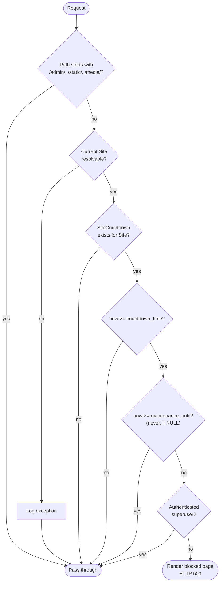

# How it works

The whole package is a small state machine driven by two timestamps on one
row, evaluated fresh on every request. Nothing is cached, nothing is
scheduled, no background worker is involved — which is why it survives
restarts, deploys and clock changes without any reconciliation logic.

## The two timestamps

```mermaid
gantt
    dateFormat HH:mm
    axisFormat %H:%M
    title One SiteCountdown row
    section Public visitors
    Banner visible          :active, 09:00, 60m
    Blocked, HTTP 503       :crit,   10:00, 30m
    Normal browsing         :done,   10:30, 30m
    section Superusers
    Banner visible          :active, 09:00, 60m
    Maintenance banner      :        10:00, 30m
    Normal browsing         :done,   10:30, 30m
```



| Field | Meaning |
|---|---|
| `countdown_time` | The moment the site closes. Everything before it is "announcement", everything after is "maintenance". |
| `maintenance_until` | The moment it reopens. `NULL` means *never automatically* — someone has to delete the row. |

## Request lifecycle

Two independent components read the same row and reach the same conclusion
from opposite ends of the request:



`CountdownBlockingMiddleware` runs this on `process_request`, so a blocked
request never reaches your view, your ORM queries or your templates.
`countdown_context` runs the same checks to decide which banner — if any —
your own templates should render.

## Who sees what

This is the table worth keeping in mind. "Public" means anonymous users *and*
authenticated non-superusers; the bypass is strictly `is_superuser`.

| Phase | Condition | Public visitor | Superuser |
|---|---|---|---|
| **Announcement** | `now < countdown_time` | Countdown banner, site works | Countdown banner, site works |
| **Maintenance** | `countdown_time ≤ now < maintenance_until` | Maintenance page, `HTTP 503` | Maintenance banner, site works |
| **Indefinite maintenance** | `countdown_time ≤ now`, `maintenance_until` is `NULL` | Maintenance page, `HTTP 503`, forever | Maintenance banner, site works |
| **Recovered** | `maintenance_until ≤ now` | No banner, site works | No banner, site works |
| **No row** | — | No banner, site works | No banner, site works |

Two consequences worth internalising:

- **Staff are not superusers.** A user with `is_staff=True` but
  `is_superuser=False` gets the 503 like everyone else. They can still reach
  `/admin/`, because that prefix is exempt from blocking entirely.
- **Recovery is passive.** Nothing rewrites the row when `maintenance_until`
  passes; the middleware simply stops matching. The stale row keeps sitting
  there until you delete it, harmless but confusing on the next incident.

## Always-open paths

Three URL prefixes are never blocked, no matter the state:

| Prefix | Why |
|---|---|
| `/admin/` | So you can always reach the admin to unblock the site |
| `/static/` | So the maintenance page can load its own stylesheet |
| `/media/` | So user-uploaded assets referenced by the page still resolve |

These are hardcoded in `CountdownBlockingMiddleware.process_request` and
cannot be configured. If your admin lives at a different path — a common
hardening measure — see the caveat in
[Settings](../reference/settings.md#exempt-url-prefixes).

## Failure behaviour

Both components fail **open**: any unexpected error is logged and the request
proceeds unblocked.

| Situation | Result |
|---|---|
| Site cannot be resolved | Exception logged to `django_countdown.middleware`, request passes |
| No `SiteCountdown` for the site | Request passes, no logging |
| Unexpected error in the context processor | Exception logged to `django_countdown.context_processors`, both context variables set to `None` |

That is a deliberate trade: a broken countdown should never take a working
site down. The flip side is that a misconfigured `SITE_ID` silently produces
*no* maintenance page, so verify your window before you rely on it.

To see those logs, route the package's loggers somewhere visible:

```python title="settings.py"
LOGGING = {
    "version": 1,
    "disable_existing_loggers": False,
    "handlers": {"console": {"class": "logging.StreamHandler"}},
    "loggers": {
        "django_countdown": {"handlers": ["console"], "level": "INFO"},
    },
}
```

## Client-side behaviour

Server-side state changes only when a request arrives, so both pages help
themselves along with a little JavaScript:

- **Countdown banner** — ticks every second; when it reaches zero it shows
  "Maintenance running" and reloads the page after 3 seconds, which is the
  request that produces the 503.
- **Maintenance page, bounded** — ticks down to `maintenance_until`, then
  shows "Maintenance finished!" and reloads after 3 seconds.
- **Maintenance page, indefinite** — no timer to show, so it simply reloads
  every 30 seconds until the site comes back.

All timers are computed from ISO-8601 timestamps rendered into the page and
compared against the browser clock, so a visitor with a badly skewed clock
sees a skewed timer. The actual blocking decision is always made server-side.
